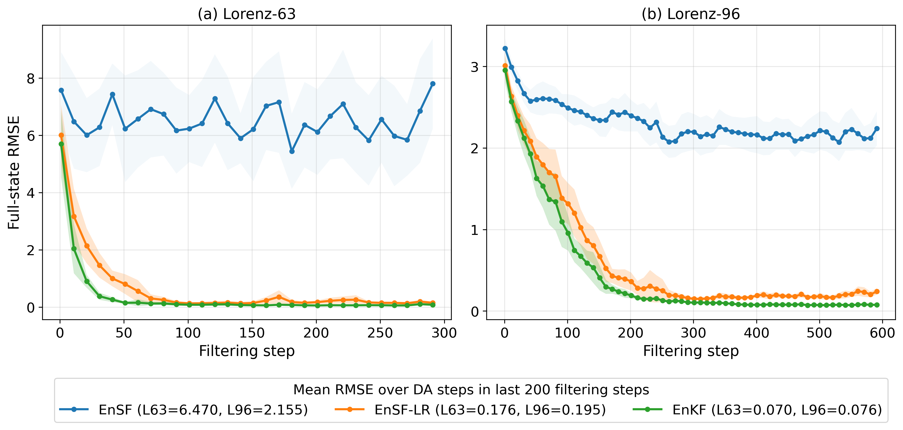
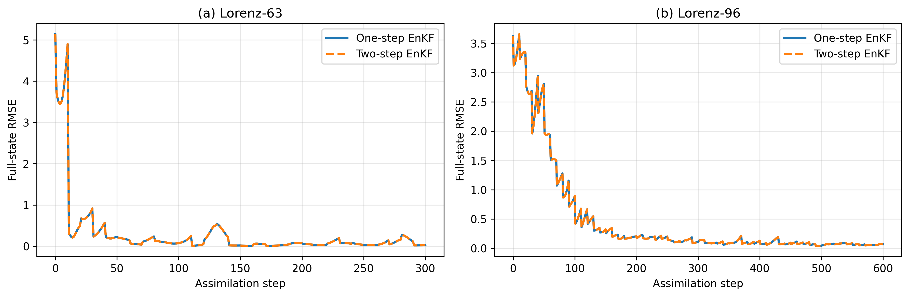
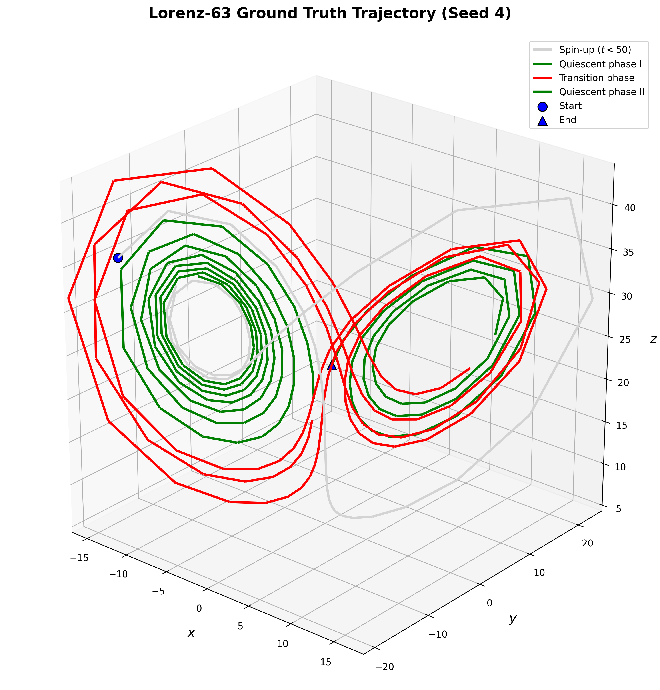
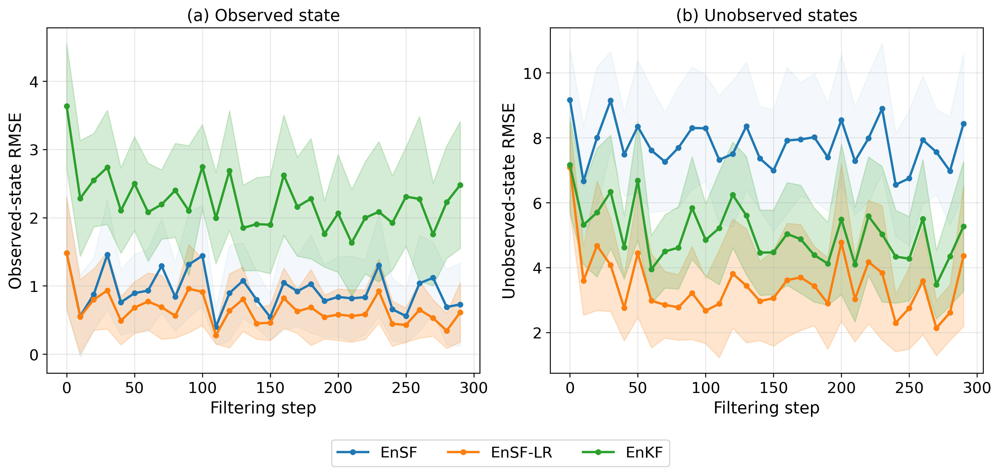
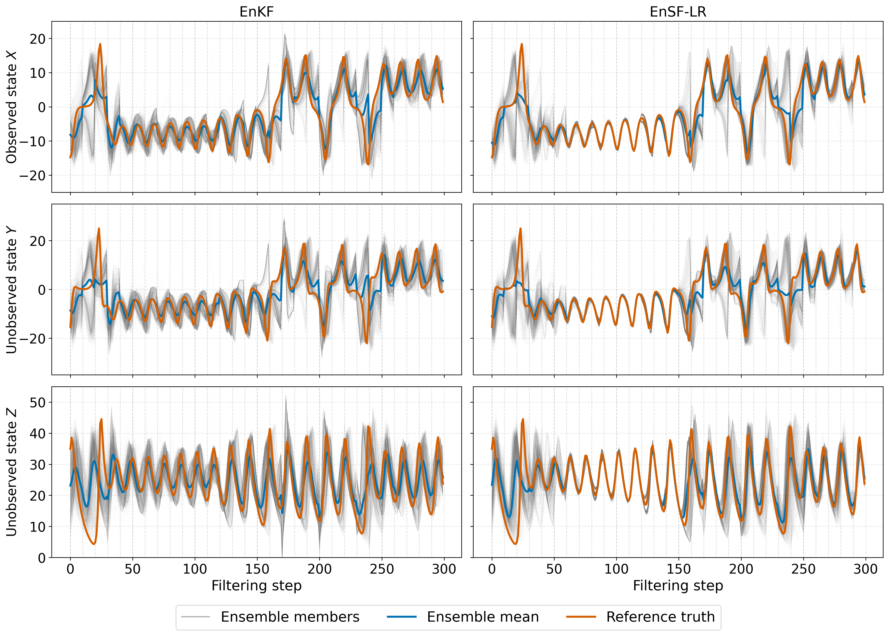
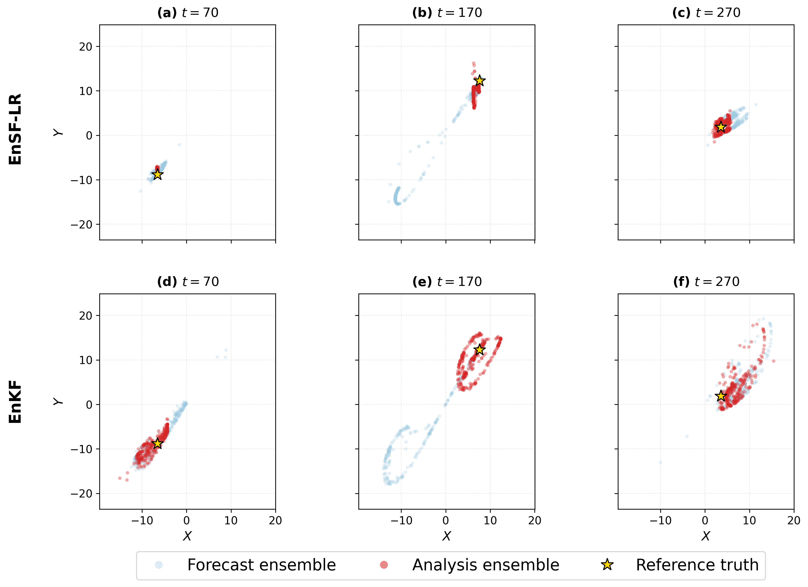
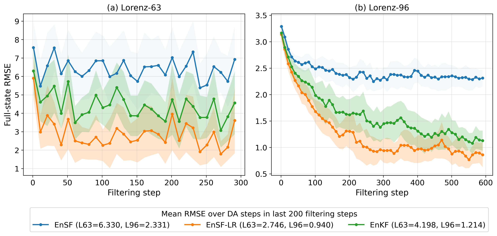
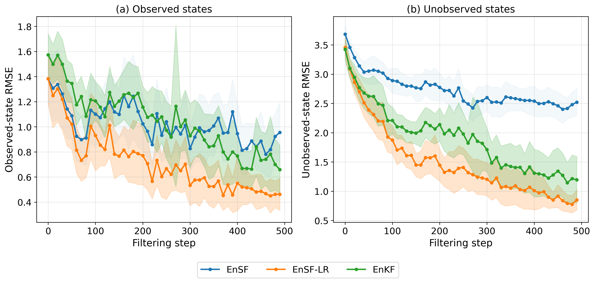
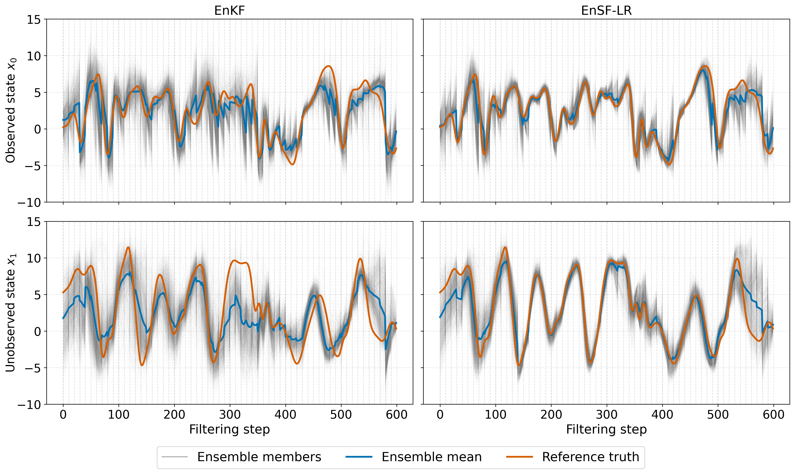
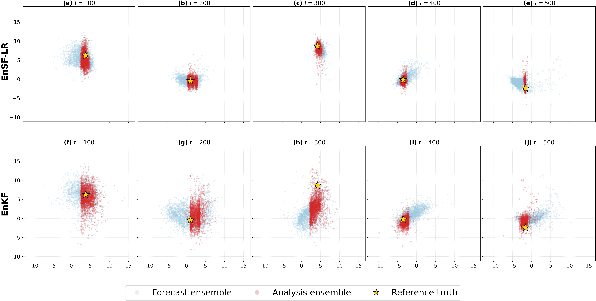

# EnSF-LR

Research code for **A Two-Step Ensemble Score Filter for Data Assimilation in Partially Observed Systems**.

This repository contains Python experiments for comparing Ensemble Score Filter with Linear Regression (EnSF-LR), Ensemble Score Filter (EnSF), and Ensemble Kalman Filter (EnKF) methods on Lorenz-63 and Lorenz-96 systems with sparse observations.

## Project Overview

EnSF-LR is designed for partially observed dynamical systems. The analysis update is split into two parts:

1. Apply a score-based reverse-SDE update to the observed state variables.
2. Transfer the observed-state correction to unobserved variables with ensemble-estimated linear regression.

The experiments cover both linear observations and nonlinear `arctan` observations.

## Repository Structure

```text
EnSF-LR/
├── Rev_SDE_vanilla.py
├── requirements.txt
├── LICENSE
├── README.md
├── Linear_lorenz63/
│   ├── generate_data_linear_lorenz63.py
│   ├── EnSF_linear_lorenz63_0.py
│   ├── EnSF_linear_lorenz63_1.py
│   ├── EnKF_linear_lorenz63_0.py
│   └── EnKF_linear_lorenz63_1.py
├── Linear_lorenz96/
│   ├── generate_data_linear_lorenz96.py
│   ├── EnSF_linear_lorenz96_0.py
│   ├── EnSF_linear_lorenz96_1.py
│   ├── EnKF_linear_lorenz96_0.py
│   ├── EnKF_linear_lorenz96_1.py
│   └── figures/
├── Nonlinear_lorenz63/
│   ├── generate_data_nonlinear_lorenz63.py
│   ├── EnSF_nonlinear_lorenz63_0.py
│   ├── EnSF_nonlinear_lorenz63_1.py
│   ├── EnKF_nonlinear_lorenz63_0.py
│   ├── EnKF_nonlinear_lorenz63_1.py
│   └── figures/
└── Nonlinear_lorenz96/
    ├── generate_data_nonlinear_lorenz96.py
    ├── EnSF_nonlinear_lorenz96_0.py
    ├── EnSF_nonlinear_lorenz96_1.py
    ├── EnKF_nonlinear_lorenz96_0.py
    ├── EnKF_nonlinear_lorenz96_1.py
    └── figures/
```

## File Roles

- `Rev_SDE_vanilla.py`: shared reverse-SDE implementation used by the EnSF scripts.
- `generate_data_*.py`: generate truth trajectories, initial ensembles, and noisy observations as CSV files in the current experiment folder.
- `EnSF_*_0.py` and `EnKF_*_0.py`: baseline filtering runs without the linear-regression transfer step.
- `EnSF_*_1.py` and `EnKF_*_1.py`: filtering runs with the linear-regression transfer step enabled.
- `figures/`: plotting scripts and selected generated figures for the experiments that include figure assets.

Generated CSV inputs and result files are intentionally not committed. Run the data-generation scripts before running an experiment script in the same folder.

## Installation

Create a Python environment, then install the dependencies:

```bash
pip install -r requirements.txt
```

The pinned versions are:

```text
numpy==1.26.4
torch==2.2.2
scipy
pandas
matplotlib
```

Keeping NumPy below version 2 is important for compatibility with the pinned PyTorch version in this repository.

## Running Experiments

Run scripts from inside the corresponding experiment directory so the generated CSV files are read and written in the expected location.

Example: nonlinear Lorenz-63 with seed `0`.

```bash
cd Nonlinear_lorenz63
python generate_data_nonlinear_lorenz63.py
python EnSF_nonlinear_lorenz63_0.py 0
python EnSF_nonlinear_lorenz63_1.py 0
python EnKF_nonlinear_lorenz63_0.py 0
python EnKF_nonlinear_lorenz63_1.py 0
```

Example: linear Lorenz-96 with seed `0`.

```bash
cd Linear_lorenz96
python generate_data_linear_lorenz96.py
python EnSF_linear_lorenz96_0.py 0
python EnSF_linear_lorenz96_1.py 0
python EnKF_linear_lorenz96_0.py 0
python EnKF_linear_lorenz96_1.py 0
```

The experiment scripts accept an optional seed argument. If no seed is supplied, they default to `50`, but the current data generators do not all create seed `50` by default:

- Lorenz-63 generators create seeds `0` through `19`.
- Lorenz-96 generators create seed `0`.

Use one of the generated seeds, or edit the loop at the bottom of the relevant `generate_data_*.py` script to create additional seeds.

## Experiment Folders

- `Linear_lorenz63/`: Lorenz-63 with sparse linear observations.
- `Linear_lorenz96/`: Lorenz-96 with sparse linear observations.
- `Nonlinear_lorenz63/`: Lorenz-63 with sparse nonlinear observations using `arctan`.
- `Nonlinear_lorenz96/`: Lorenz-96 with sparse nonlinear observations using `arctan`.

Each folder follows the same general pattern: generate data first, run EnSF and EnKF baselines, then run the `_1.py` scripts to produce the linear-regression variants.

## Paper Figures

The figures below are organized to follow the structure of the paper: first the linear-observation validation experiments, then the nonlinear Lorenz-63 case, and finally the nonlinear Lorenz-96 case.

### Linear-observation experiments



This figure summarizes analysis RMSE for the linear-observation experiments on Lorenz-63 and Lorenz-96. It compares EnSF-LR with EnSF and EnKF baselines across the partially observed settings.



This diagnostic figure verifies the relationship between the standard EnKF update and the two-step linear-regression form used as a reference point for the EnSF-LR construction.

### Nonlinear Lorenz-63 experiments



This figure shows the Lorenz-63 truth trajectory used to illustrate the nonlinear dynamical regime and the assimilation intervals.



This figure separates performance on directly observed and unobserved Lorenz-63 variables under nonlinear observations, including ensemble spread information.



This trajectory figure compares EnKF and EnSF-LR analyses against the Lorenz-63 truth for the observed and unobserved state components.



This scatter comparison shows how the forecast and analysis ensembles align with the truth for Lorenz-63, highlighting the effect of the EnSF-LR update under nonlinear observations.

### Nonlinear Lorenz-96 experiments



This figure provides the main nonlinear-observation RMSE comparison across Lorenz-63 and Lorenz-96, summarizing the relative performance of EnSF-LR, EnSF, and EnKF.



This figure breaks down Lorenz-96 nonlinear assimilation accuracy on observed and unobserved state variables, with spread shown alongside RMSE.



This trajectory comparison focuses on representative Lorenz-96 state components and contrasts EnKF with EnSF-LR over the assimilation window.



This scatter figure compares forecast and analysis behavior for selected Lorenz-96 components, showing how EnSF-LR changes the ensemble relative to EnKF in the nonlinear-observation case.

## Outputs

Experiment scripts write CSV files such as:

- `X_initial_forecast*_seed*.csv`
- `x_truth_trajectory*_seed*.csv`
- `y_observation_trajectory*_seed*.csv`
- `RMSE_*_seed*.csv`
- trajectory CSV files for selected `_1.py` runs

Plotting scripts under `figures/` expect these generated CSV outputs to exist with the filenames used in the plotting code.

## Citation

If you use this code, please cite:

```bibtex
@article{xiong2026ensflr,
  title={A Two-Step Ensemble Score Filter for Data Assimilation in Partially Observed Systems},
  author={Xiong, Zixiang and Bao, Feng and Chipilski, Hristo G. and Liang, Siming and Tang, Jingqiao and Zhang, Guannan},
  year={2026}
}
```
